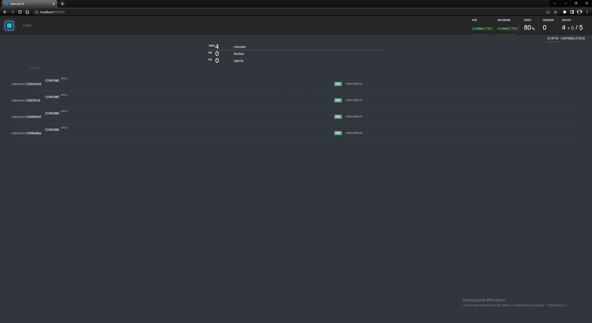
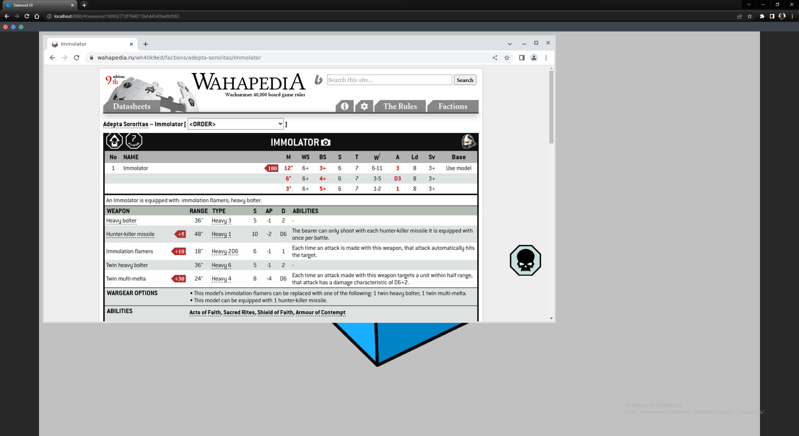
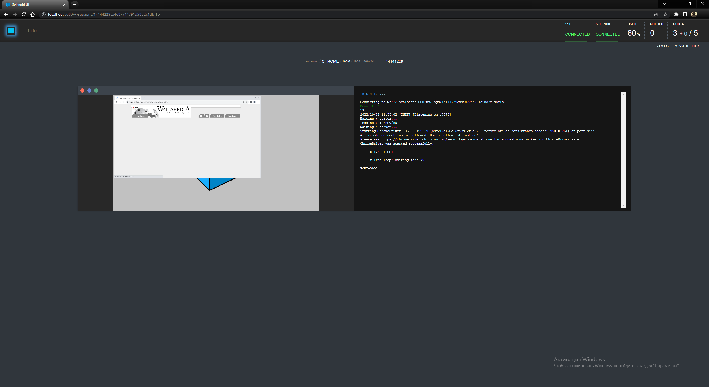
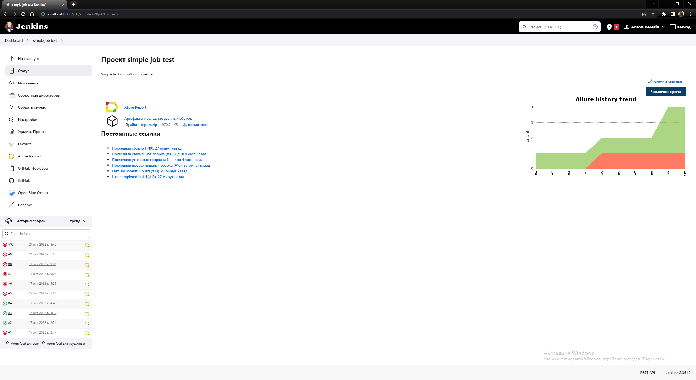
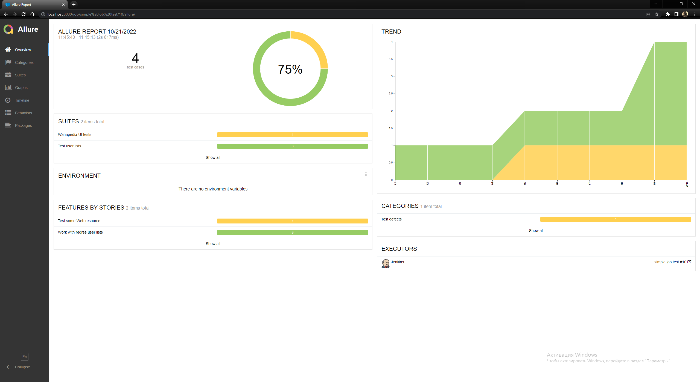

<a href="https://github.com/"></a>

# GitHub. QA demo project

## Content :bookmark_tabs:

* <a href="#stack">Technology stack</a>
* <a href="#objects">Test basis</a>
* <a href="#console">Run test from comandline</a>
* <a href="#code">Code</a>
    + <a href="#intelij">InteliJ IDEA, Java, JUnit 5, Selenide, Rest Assured</a>
    + <a href="#maven">Maven</a>


<a id="stack"></a>

## Technology stack :hammer_and_wrench:

<div align="center">
<a href="https://www.jetbrains.com/idea/"></a>
<a href="https://www.java.com/"></a>
<a href="https://junit.org/junit5/"></a>
<a href="https://selenide.org/"></a>
<a href="https://rest-assured.io/"></a>
<a href="https://aerokube.com/selenoid/"></a>
<a href="https://maven.apache.org/"></a>
<a href="https://www.jenkins.io/"></a>
<a href="https://github.com/allure-framework/"></a>
<a href="https://github.com/"></a>
</div>

<a id="objects"></a>

## Test basis :mag:

In this project I've created tests for 2 resources - Reqres.in and Wahapedia.ru:

* API work with:

:white_check_mark: POJO

:white_check_mark: GET, POST, PUT, PATCH, DELETE

:white_check_mark: Status codes


* UI:

:white_check_mark: Work with PageObject

:white_check_mark: Find element

:white_check_mark: Check element text

:white_check_mark: Work with element collections

<a id="console"></a>

## Local run :computer:

```bash
mvn clean test 
-Dtest=${TEST_TYPE}

```

## Selenoid run :computer:

```bash
mvn clean test 
-Dtest=${TEST_TYPE}
-Dhost=remote

```

> `${TEST_TYPE}` - JUnit filtering by Tags  [ *REGRESS* <sub>(default)</sub> , *API*, *UI* ]
>


<a id="code"></a>

## Code :floppy_disk:

<a id="intelij"></a>

#### InteliJ IDEA</a>Java</a>JUnit 5</a>Selenide</a>Rest Assured</a>

> *Simple API autotest realisation*

```java

@Tags({@Tag("API"), @Tag("USER_LIST"), @Tag("REGRESS")})
@Owner("proto")
@Feature("Work with reqres user lists")
@DisplayName("Test user lists")
public class UserListTest extends TestBase {
    @Test
    @DisplayName("List of Users is not Empty")
    void listOfUsersNotEmptyTest() {
        Specifications.setUpSpec(Specifications.reqSpec(), Specifications.resSpec(200));
        AtomicReference<List<User>> userList = new AtomicReference<>();

        step("Given a list of users from site", () ->
                userList.set(
                        given()
                                .when()
                                .get(Reqres.users, 2)
                                .then().log().all()
                                .extract().body().jsonPath().getList("data", User.class)));

        step("Check that user list is not empty", () ->
                assertFalse(userList.get().isEmpty()));
    }
}
```

> *Simple UI autotest realisation*

```java

@Tags({@Tag("UI"), @Tag("REGRESS")})
@Owner("proto")
@Feature("Test some Web resource")
@DisplayName("Wahapedia UI tests")
public class WahapediaTest extends TestBase {

    @Test
    @DisplayName("Test game choose")
    public void checkMainPageText() {
        String mainPageHeaderText = "Playing This Game";
        AtomicReference<String> headerText = new AtomicReference<>();

        step("Open web resource, choose game and get header text", () ->
                headerText.set(new WHGameChoosePage()
                        .chooseWHGame()
                        .getHeaderText()));

        step("Assert that we open right game", () ->
                assertEquals(mainPageHeaderText, headerText.get()));
    }
}
```

<a id="screenshot"></a>

## Screenshots :camera_flash:

<a id="selenoid"></a>

#### Selenoid</a>

> *Run UI test on Selenoid*

<table>
    <tr>
        <td>
        
        </a>
        </td>
        <td>
        
        </a>
        </td>
        <td>
        
        </a>
        </td>
    </tr>
</table>


<a id="jenkins"></a>

#### Jenkins</a>

> *Local Jenkins in docker*

<a>

</a>


<a id="allure"></a>

#### </a>Allure Report</a>

> *Allure reporting*

<table>
    <tr>
        <td>
        
        </a>
        </td>
        <td>
        
        </a>
        </td>
</table>
